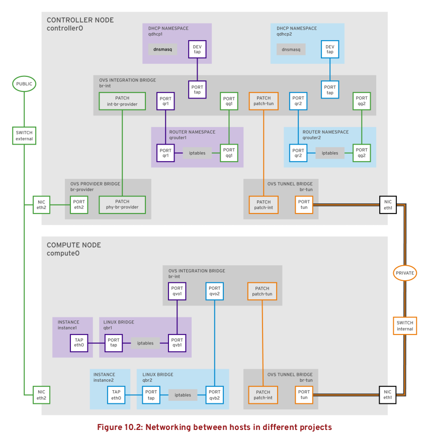
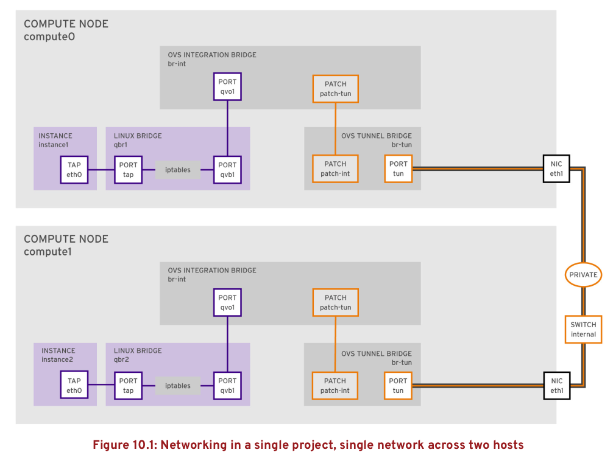

# OpenStack Training Additional Materials

## Extra Tips
This section describes extra tips for the course

### Dump Overcloud Containers run commands
When containers in the overcloud cannot be restarted with a simple
`docker restart <containername>` command, **paunch** (https://github.com/openstack/paunch)
can be used to regenerate the correct run parameters.
For example, the **Nova Compute** service extra parameters can be
retrieved from the generated **paunch** configuration files.

Containers are started by Paunch using files under */var/lib/tripleo-config/*.

The first step is to identify the file defining the service:

```
# grep -lr openstack-nova-compute /var/lib/tripleo-config/docker-container-startup-config*
/var/lib/tripleo-config/docker-container-startup-config-step_4.json
```

In this example the file */var/lib/tripleo-config/docker-container-startup-config-step_4.json*
defines the execution of the nova-compute service in a compute node.

Another way to find the config step is to check the config_id labels in the container:
```
# docker inspect nova_compute -f "{{ .Config.Labels.config_id }}"
tripleo_step4
```


Now `paunch` can be used to regenerate a configuration:

```
# paunch debug --file /var/lib/tripleo-config/docker-container-startup-config-step_4.json \
  --container nova_compute --action print-cmd
```

The option `--container` defines the container name while the `--action` option
defines the desired action, in this case `print-cmd`.
The generated output (without newlines) will be:

```
docker run --name nova_compute-7f6f6ixp --detach=true \
--env=KOLLA_CONFIG_STRATEGY=COPY_ALWAYS \
--net=host --ipc=host \--privileged=true \
--restart=always \
--user=nova \
--volume=/etc/hosts:/etc/hosts:ro \
--volume=/etc/localtime:/etc/localtime:ro \
--volume=/etc/puppet:/etc/puppet:ro \
--volume=/etc/pki/ca-trust/extracted:/etc/pki/ca-trust/extracted:ro \
--volume=/etc/pki/tls/certs/ca-bundle.crt:/etc/pki/tls/certs/ca-bundle.crt:ro \
--volume=/etc/pki/tls/certs/ca-bundle.trust.crt:/etc/pki/tls/certs/ca-bundle.trust.crt:ro \
--volume=/etc/pki/tls/cert.pem:/etc/pki/tls/cert.pem:ro \
--volume=/dev/log:/dev/log \
--volume=/etc/ssh/ssh_known_hosts:/etc/ssh/ssh_known_hosts:ro \
--volume=/var/lib/kolla/config_files/nova_compute.json:/var/lib/kolla/config_files/config.json:ro \
--volume=/var/lib/config-data/puppet-generated/nova_libvirt/:/var/lib/kolla/config_files/src:ro \
--volume=/etc/ceph:/var/lib/kolla/config_files/src-ceph:ro \
--volume=/dev:/dev \
--volume=/lib/modules:/lib/modules:ro \
--volume=/etc/iscsi:/etc/iscsi \
--volume=/run:/run \
--volume=/var/lib/nova:/var/lib/nova:shared \
--volume=/var/lib/libvirt:/var/lib/libvirt \
--volume=/var/log/containers/nova:/var/log/nova \
--volume=/sys/class/net:/sys/class/net \
--volume=/sys/bus/pci:/sys/bus/pci \
192.168.24.1:8787/rhosp12/openstack-nova-compute:2017-12-06.2
```

Notice that this contiainer is privileged and used host net and ipc namespaces.
Notice the many *volume* options passed to the container to mount files and
directories inside the container.
For example, the Puppet generated configs for Nova (*/var/lib/config-data/puppet-generated/nova_libvirt/*)
are mounted in */var/lib/kolla/config_files/src* readonly.

The output command can be executed manually. Alternatively, the following
command simply runs the container directly using the debug results:

```
# paunch debug --file /var/lib/tripleo-config/docker-container-startup-config-step_4.json `
  -- container nova_compute --action run
  69700e99911eb16274b46fc4d2413527c71e367e325fc04534906ffbee605f3b
```

The ouput shows the started container id.

### Recover Docker installation in a Node
To restart all the containers in a node, for example to recover a corrupted
docker storage, etc all the running containers must be first stopped.

```
# for i in $(docker ps -q); do echo $i; docker stop $i; done
```

After this, docker service can be stopped and the storage directory cleaned up:
```
# mkdir /root/docker-backup
# systemctl stop docker
# mv /var/lib/docker/* /root/docker-backup
# systemctl start docker
```

Now, use paunch to apply configurations again and restart all the containers:
```
# for i in $(seq 6); do echo "Step $i"; paunch --debug apply \
  --file /var/lib/tripleo-config/hashed-docker-container-startup-config-step_$i.json \
  --config-id tripleo_step$i --managed-by tripleoController; done
```

This action will also restart rabbitmq, redis, galera and haproxy services, thus
a pcs resource cleanup is needed:
```
# pcs resource cleanup --all
```

### OVN Short Intro
**OVN** (Open Virtual Network), is a system to support **L2 and L3 virtual network
abstraction** by extending the capabilities of OVS with virtual L2 and L3
overlays and security groups.
OVN can implement logical network over physical networks and supports many
kind of tunnel overlays (Genece, STT, VXLAN).

The architecture of OVN from North to South implies different components.
On top a **Cloud Management System** (OpenStack), using a CMS Plugin
(Neutron ML2 Plugin for OVN), communicates with the OVN NOrthBound Database,
which receives the logical representation passed by the CMS plugin and
store declarative informations of logical network components to define.

The OVN Northbound DB communicates with the **ovn-northd** service, whose role
is to translate the abstract logical network configurations into logical
datapath flows in the **OVN Southbound Database**, the real center of the
system.

The OVN Southbound DB contains:
- **Physical Network** (PN) tables to specify how to reach hypervisors. This
  tables is populated by the hypervisors.
- **Logical Network** (LN) tables to describe the logical network in terms of
  logical datapath flows. This table is populated by the ovn-northd.
- **Binding** tables that link logical components locations to the physical
  network. This table is populated by the hypervisors.

The **ovn-controller** runs on every node or hypervisor and populates the
Southbound DB while also learning from it the OVN configuration to apply locally.
Southbound, it connects to the **ovs-vswitchd** (as an OpenFlow controller)
and **ovsdb-server**.

```
                                         CMS
                                          |
                                          |
                              +-----------|-----------+
                              |           |           |
                              |     OVN/CMS Plugin    |
                              |           |           |
                              |           |           |
                              |   OVN Northbound DB   |
                              |           |           |
                              |           |           |
                              |       ovn-northd      |
                              |           |           |
                              +-----------|-----------+
                                          |
                                          |
                                +-------------------+
                                | OVN Southbound DB |
                                +-------------------+
                                          |
                                          |
                       +------------------+------------------+
                       |                  |                  |
         HV 1          |                  |    HV n          |
       +---------------|---------------+  .  +---------------|---------------+
       |               |               |  .  |               |               |
       |        ovn-controller         |  .  |        ovn-controller         |
       |         |          |          |  .  |         |          |          |
       |         |          |          |     |         |          |          |
       |  ovs-vswitchd   ovsdb-server  |     |  ovs-vswitchd   ovsdb-server  |
       |                               |     |                               |
       +-------------------------------+     +-------------------------------+
```

In OpenStack he Neutron OVN ML2 Plugin replaces the OVS ML2 Plugin with significant
improvements in performances, especially instances startup time.

In the Overcloud environment the OVN/CMS plugin, Northbound DB, ovn-northd and
Southbound DB run on the controller nodes.
The ovn-controller runs on the compute nodes.

#### Monitoring logical flows
Logical flows defined in the Southbound DB can be monitored using the utility
`ovn-sbctl`:

```
# ovn-sbctl -db=tcp:172.17.1.10:6642 lflow-list
    Datapath: "sw0" (d7bf4a7b-e915-4502-8f9d-5995d33f5d10)  Pipeline: ingress
      table=0 (ls_in_port_sec_l2  ), priority=100  , match=(eth.src[40]), action=(drop;)
      table=0 (ls_in_port_sec_l2  ), priority=100  , match=(vlan.present), action=(drop;)
      table=0 (ls_in_port_sec_l2  ), priority=50   , match=(inport == "sw0-port1" && eth.src == {00:00:00:00:00:01}), action=(next;)
      table=0 (ls_in_port_sec_l2  ), priority=50   , match=(inport == "sw0-port2" && eth.src == {00:00:00:00:00:02}), action=(next;)
      table=1 (ls_in_port_sec_ip  ), priority=0    , match=(1), action=(next;)
      table=2 (ls_in_port_sec_nd  ), priority=90   , match=(inport == "sw0-port1" && eth.src == 00:00:00:00:00:01 && arp.sha == 00:00:00:00:00:01), action=(next;)
      table=2 (ls_in_port_sec_nd  ), priority=90   , match=(inport == "sw0-port1" && eth.src == 00:00:00:00:00:01 && ip6 && nd && ((nd.sll == 00:00:00:00:00:00 || nd.sll == 00:00:00:00:00:01) || ((nd.tll == 00:00:00:00:00:00 || nd.tll == 00:00:00:00:00:01)))), action=(next;)
      table=2 (ls_in_port_sec_nd  ), priority=90   , match=(inport == "sw0-port2" && eth.src == 00:00:00:00:00:02 && arp.sha == 00:00:00:00:00:02), action=(next;)
      table=2 (ls_in_port_sec_nd  ), priority=90   , match=(inport == "sw0-port2" && eth.src == 00:00:00:00:00:02 && ip6 && nd && ((nd.sll == 00:00:00:00:00:00 || nd.sll == 00:00:00:00:00:02) || ((nd.tll == 00:00:00:00:00:00 || nd.tll == 00:00:00:00:00:02)))), action=(next;)
      table=2 (ls_in_port_sec_nd  ), priority=80   , match=(inport == "sw0-port1" && (arp || nd)), action=(drop;)
      table=2 (ls_in_port_sec_nd  ), priority=80   , match=(inport == "sw0-port2" && (arp || nd)), action=(drop;)
      table=2 (ls_in_port_sec_nd  ), priority=0    , match=(1), action=(next;)
      table=3 (ls_in_pre_acl      ), priority=0    , match=(1), action=(next;)
      table=4 (ls_in_pre_lb       ), priority=0    , match=(1), action=(next;)
      table=5 (ls_in_pre_stateful ), priority=100  , match=(reg0[0] == 1), action=(ct_next;)
      table=5 (ls_in_pre_stateful ), priority=0    , match=(1), action=(next;)
      table=6 (ls_in_acl          ), priority=0    , match=(1), action=(next;)
      table=7 (ls_in_qos_mark     ), priority=0    , match=(1), action=(next;)
      table=8 (ls_in_lb           ), priority=0    , match=(1), action=(next;)
      table=9 (ls_in_stateful     ), priority=100  , match=(reg0[1] == 1), action=(ct_commit(ct_label=0/1); next;)
      table=9 (ls_in_stateful     ), priority=100  , match=(reg0[2] == 1), action=(ct_lb;)
      table=9 (ls_in_stateful     ), priority=0    , match=(1), action=(next;)
      table=10(ls_in_arp_rsp      ), priority=0    , match=(1), action=(next;)
      table=11(ls_in_dhcp_options ), priority=0    , match=(1), action=(next;)
      table=12(ls_in_dhcp_response), priority=0    , match=(1), action=(next;)
      table=13(ls_in_l2_lkup      ), priority=100  , match=(eth.mcast), action=(outport = "_MC_flood"; output;)
      table=13(ls_in_l2_lkup      ), priority=50   , match=(eth.dst == 00:00:00:00:00:01), action=(outport = "sw0-port1"; output;)
      table=13(ls_in_l2_lkup      ), priority=50   , match=(eth.dst == 00:00:00:00:00:02), action=(outport = "sw0-port2"; output;)
    Datapath: "sw0" (d7bf4a7b-e915-4502-8f9d-5995d33f5d10)  Pipeline: egress
      table=0 (ls_out_pre_lb      ), priority=0    , match=(1), action=(next;)
      table=1 (ls_out_pre_acl     ), priority=0    , match=(1), action=(next;)
      table=2 (ls_out_pre_stateful), priority=100  , match=(reg0[0] == 1), action=(ct_next;)
      table=2 (ls_out_pre_stateful), priority=0    , match=(1), action=(next;)
      table=3 (ls_out_lb          ), priority=0    , match=(1), action=(next;)
      table=4 (ls_out_acl         ), priority=0    , match=(1), action=(next;)
      table=5 (ls_out_qos_mark    ), priority=0    , match=(1), action=(next;)
      table=6 (ls_out_stateful    ), priority=100  , match=(reg0[1] == 1), action=(ct_commit(ct_label=0/1); next;)
      table=6 (ls_out_stateful    ), priority=100  , match=(reg0[2] == 1), action=(ct_lb;)
      table=6 (ls_out_stateful    ), priority=0    , match=(1), action=(next;)
      table=7 (ls_out_port_sec_ip ), priority=0    , match=(1), action=(next;)
      table=8 (ls_out_port_sec_l2 ), priority=100  , match=(eth.mcast), action=(output;)
      table=8 (ls_out_port_sec_l2 ), priority=50   , match=(outport == "sw0-port1" && eth.dst == {00:00:00:00:00:01}), action=(output;)
      table=8 (ls_out_port_sec_l2 ), priority=50   , match=(outport == "sw0-port2" && eth.dst == {00:00:00:00:00:02}), action=(output;)
```

Logical flows are similar - but not the same - to OpenFlow rules. All items
in the logical flows are logical and not yet mapped to physical counterpairs

To see the available chassis (ie compute nodes) from the southbound
point of view:

```
$ ovs-sbctl show
Chassis "d03bdd51-e687-4078-aa54-0ff8007db0b5"
    hostname: "compute-3"
    Encap geneve
        ip: "10.0.0.4"
        options: {csum="true"}
    Encap vxlan
        ip: "10.0.0.4"
        options: {csum="true"}
Chassis "b89b8683-7c74-43df-8ac6-1d57ddefec77"
    hostname: "compute-2"
    Encap vxlan
        ip: "10.0.0.2"
        options: {csum="true"}
    Encap geneve
        ip: "10.0.0.2"
        options: {csum="true"}
```

#### OVN Materials
https://docs.openstack.org/networking-ovn/latest/admin/ovn.html
http://www.openvswitch.org/support/dist-docs/ovn-architecture.7.html

### Images




